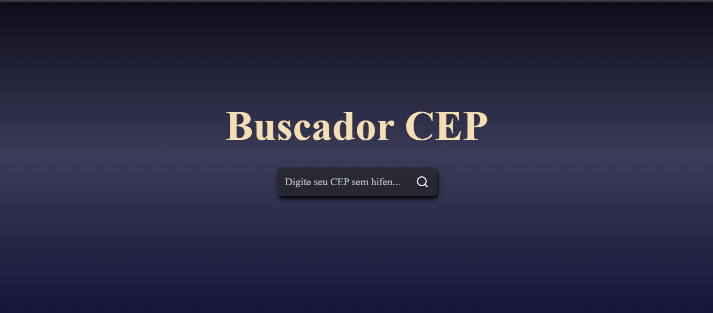

✨ Projeto: Buscador de CEP com React

Recentemente desenvolvi um Buscador de CEP usando React, onde o usuário insere o CEP desejado e recebe as informações de endereço, bairro, cidade e estado. Foi uma ótima oportunidade para reforçar conceitos importantes de desenvolvimento web e aprender boas práticas de UX.

🚀 Tecnologias Utilizadas:

- ReactJS: Criação de componentes e gerenciamento de estado com hooks (useState).
- Axios: Cliente HTTP para consumir a API de busca de CEP.
- React Icons: Ícones personalizados para melhorar a interface (por exemplo, o ícone de lupa).
- CSS: Estilização da aplicação, incluindo responsividade e design minimalista.

🔑 Funcionalidades:

- Permite ao usuário digitar um CEP e buscar os dados de endereço.
- Exibe informações como rua, bairro, cidade, estado e complemento.
- Implementa tratamento de erros, alertando o usuário se o CEP não for encontrado.
- Limpa o campo de busca e os dados exibidos ao iniciar uma nova pesquisa, evitando que dados antigos sejam exibidos erroneamente.
- Utiliza requisições assíncronas para garantir que a busca seja feita de forma não bloqueante.

🛠️ Conceitos e Boas Práticas:

- Gerenciamento de estado com useState, para controlar o valor do input e o resultado do CEP.
- Renderização condicional: o resultado só aparece se houver dados válidos, usando {Object.keys(cep).length > 0 && (...)}.
- Async/Await para tratar chamadas assíncronas e melhorar a legibilidade do código.
- Tratamento de erros com try/catch, incluindo exibição de alertas para o usuário.
- Limpeza de estado antes de cada nova busca para garantir que dados antigos não persistam na tela.

📈 Aprendizado:
Este projeto me ajudou a:

- Refletir sobre a importância da experiência do usuário e do feedback visual durante as buscas.
- Compreender melhor como lidar com estados assíncronos em React.
- Praticar integração com APIs externas e tratamento de dados dinâmicos.

Foi feito um novo arquivo: vercel.json para funcionar o deploy na Vercel

E no api.jsx, deixei a baseURL vazia

</img>
